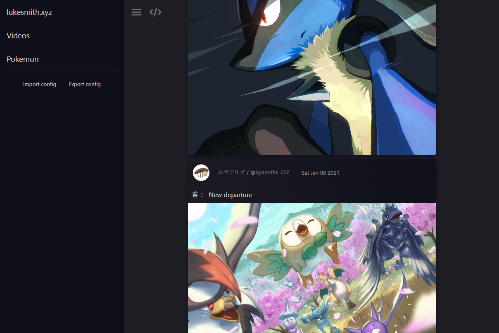

[](https://forthebadge.com)
[](https://forthebadge.com)


wewrss is an rss PWA with no backend. Feeds are configured and manually imported/exported as json, feed data is then updated using the configured cors proxy.

**#01** of my [2021 weekly projects](https://vec-t.com/weekly.html).



--- 

## Config object shape

Channels can have either a `single` or `aggregate` kind, and are shaped as shown below.

If set, the `type` determines which renderer is used to present the channel. Supported renderers are `microblog`, `article` and `video`.

```json
{
  "corsProxy": "https://cors.vec-t.com/",
  "channels": [
    {
      "kind": "single",
      "name": "POTUS",
      "source": "https://nitter.net/potus/rss",
      "type": "microblog"
    },
    {
      "kind": "aggregate",
      "name": "twitter politics",
      "type": "microblog",
      "feeds": [
        {
          "kind": "single",
          "name": "Joe Biden",
          "source": "https://nitter.net/joebiden/rss",
          "type": null
        },
        {
          "kind": "single",
          "name": "Obama",
          "source": "https://nitter.net/barackobama/rss",
          "type": null
        }
      ]
    }
  ]
}
```

## Development

```shell
$ npm i -g snowpack
$ npm install
$ npm start
```

## Build

```shell
$ npm run build
```
